# Secure-by-Default Starter: Architecture Overview

This document describes the architecture, controls, and evidence flow of the Secure-by-Default Starter.

---

## Legend & Assumptions

**Legend**
- Solid arrow: normal flow
- Dashed arrow: visibility/evidence
- 🔒 = security control
- 📦 = artifact

**Assumptions**
- GitHub Actions runners (ubuntu-latest)
- Docker available for local parity (`make scan`, `make sbom`)
- No GitHub Advanced Security required (works on Free); complements it if enabled

---

## Flow Overview

---

## Sequence View

```mermaid
sequenceDiagram
    autonumber
    participant Dev as Developer
    participant Repo as GitHub Repo
    participant CI as GitHub Actions
    participant Trivy as Trivy Scanner
    participant GHSec as Code Scanning (SARIF)
    participant Art as Artifacts (SBOM)

    Dev->>Dev: pre-commit (🔒 Gitleaks) blocks secrets
    Dev->>Repo: push branch / open PR
    Repo-->>CI: trigger security workflow
    CI->>Trivy: fs scan (vuln + IaC) with HIGH/CRIT gate
    Trivy-->>CI: results (exit-code 0/1)
    CI->>GHSec: upload SARIF (📦 evidence)
    CI->>Art: publish sbom.spdx.json (📦 evidence)
    CI-->>Repo: status checks (pass/fail gate)
```

---

## Components & Responsibilities

| Component | Responsibility | Evidence Produced |
|---|---|---|
| Pre-commit (Gitleaks) 🔒 | Stop hardcoded secrets before push | Local terminal output; blocked commit |
| Trivy (CI) 🔒 | Vulnerability + IaC misconfig scan; fail on HIGH/CRIT | SARIF uploaded to Code scanning |
| SBOM step 📦 | Generate SPDX JSON of repo dependencies/assets | `sbom.spdx.json` artifact in Actions |
| Branch Protection 🔒 | Enforce PR review & passing checks | Protected branch status |
| Dependabot | Open dependency update PRs | PRs labeled `dependencies` |
| OpenSSF Scorecard | External hygiene signal | Public score/badge |
| Trust Page | Single place to find status & evidence | `docs/trust-page.md` |

---

## Threat Model (Starter)

**Assets**
- Source code (confidentiality/integrity)
- SBOM + SARIF artifacts (integrity)
- Secret material (must never enter repo)

**Key Risks & Controls**
- Secret leakage → 🔒 pre-commit Gitleaks blocks locally
- Vulnerabilities / misconfigs → 🔒 Trivy CI gate on HIGH/CRIT
- Unreviewed/unsafe merges → 🔒 Branch protection + required checks
- Supply-chain drift → Dependabot weekly updates; SBOM per run
- Lack of evidence for auditors → SARIF in Code scanning + SPDX artifact + Trust page

---

## Evidence Retention & Privacy

- **Artifacts**: `sbom.spdx.json` retained per Actions retention policy (repo setting).
- **SARIF alerts**: stored in GitHub Security → Code scanning.
- **No secrets**: baseline prevents secrets from entering history; rotate immediately if detected locally.

---

## Extensibility

- **Supply chain**: Cosign/SLSA attestations → after SBOM step.
- **Kubernetes policy**: Kyverno/Conftest → additional CI job; optional PR annotations.
- **AI/LLM repos**: add model/package scanners (e.g., known-bad weights/licenses) → new job, same gating model.
- **GitHub Advanced Security**: enable Push Protection, CodeQL → complements Trivy; keep both.

---

## Controls Matrix (Quick Map)

| Risk | Control | Where |
|---|---|---|
| Secrets in commits | 🔒 Gitleaks pre-commit | Developer laptop |
| Critical CVEs | 🔒 Trivy gate HIGH/CRIT | CI |
| IaC misconfig | 🔒 Trivy config scanner | CI |
| Unknown assets | 📦 SPDX SBOM per run | CI Artifacts |
| Unreviewed merge | 🔒 Branch protection | Repo settings |
| Stale deps | Dependabot weekly PRs | GitHub PRs |
