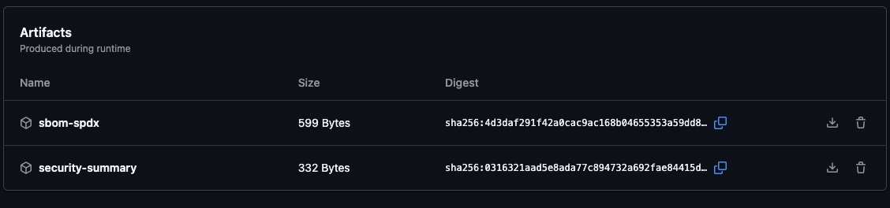
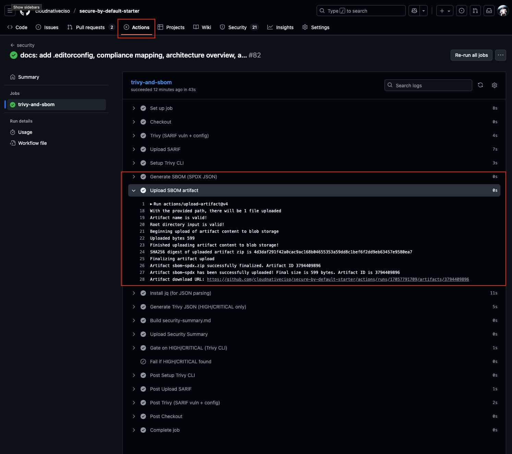
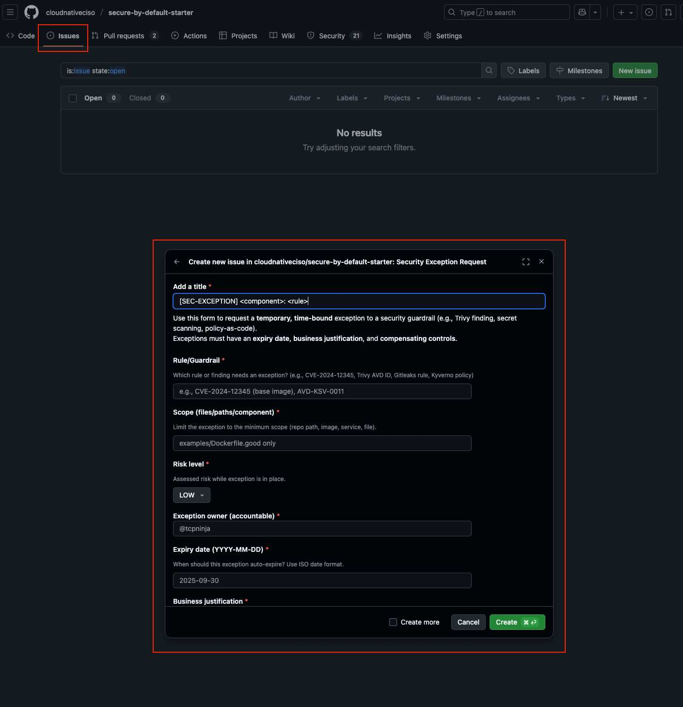

# Security & Trust Overview

**Last CI security scan:** 
**Latest SBOM artifact:** Available via **GitHub Actions → latest run → Artifacts → `sbom-spdx`**

**Guardrails in place:**
- Secrets scanning (pre-commit Gitleaks)
- CI vulnerability & IaC scanning (Trivy, fails on HIGH/CRITICAL)
- SPDX SBOM generated for every run
- OpenSSF Scorecard for secure SDLC hygiene

**Policy exception process:**
Tracked via GitHub Issues → **Security Exception Request** form
(see `.github/ISSUE_TEMPLATE/security-exception.yml`)

**Contact:** [security@cloudnativeciso.com](mailto:security@cloudnativeciso.com)

---

> This page provides a starter “trust” view for stakeholders.
> All data is current as of the latest CI run.
